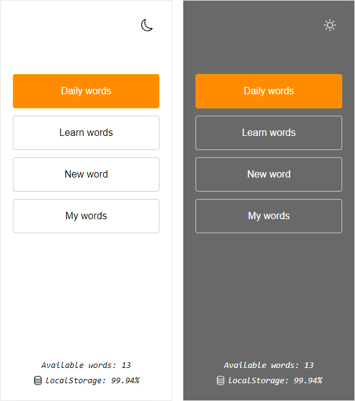
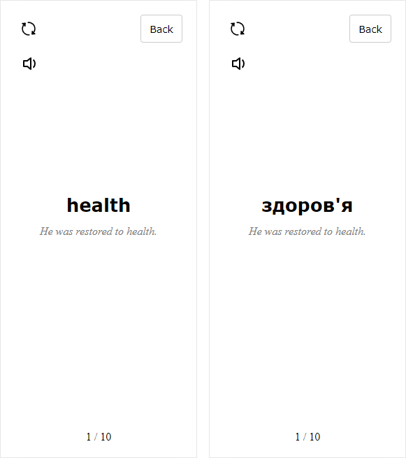
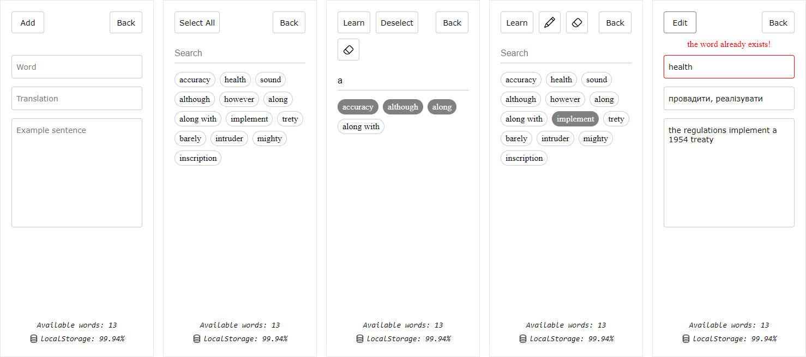

1. You can change light mode for comfortable reading in night.
    * Daily words show only once in a day. Displaying 10 words that they consist random of all your words.

 

---

2. Show translate by clicking on the word.
    * Refresh button shuffle the words

 

---

3. Add and edit words.

 

